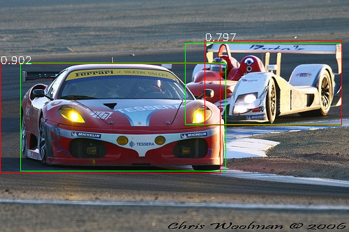
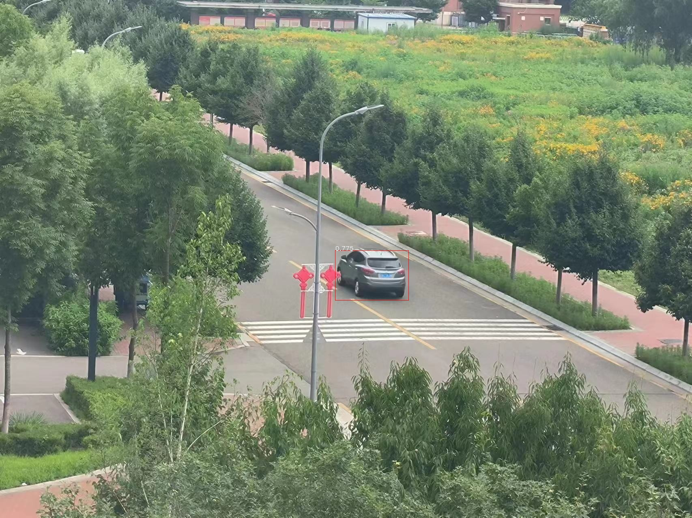

# README

### 1 环境配置

#### Python 版本

- 推荐使用 Python 3.8.10

#### 依赖库安装

```bash
pip install -r requirements.txt
```

### 2 数据准备流程

**下载 PASCAL VOC 2007 数据集**

```
python pascal_voc.py
```

**提取包含 `car` 类别的图像及标注**

```
python pascal_voc_car.py
```

**生成 fine-tune 训练所需正负样本**

```
python -m utils.data.create_classifier_data
```

**生成分类器训练数据（Hard Negative Mining使用）**

```
python -m utils.data.create_classifier_data.py
```

**生成边界框回归数据**

```
python -m utils.data.create_bbox_regression_data
```

### 3 模型训练步骤

**训练特征提取模型（AlexNet）**

```
python finetune.py
```

**训练SVM分类器（含Hard Negative Mining）**

```
python linear_svm.py
```

**训练边界框回归器**

```
python bbox_regression.py
```

> 所有模型权重将自动保存在 `./models/` 目录下

### 4 检测器运行（推理阶段）

运行以下命令可对测试图像进行车辆检测，并可视化结果：

```
python car_detector.py
```

检测结果将：

- 在图像上绘制真实标注框（绿色）与检测框（红色）
- 显示每个候选框的分类置信度（score）
- 自动执行NMS，优化最终输出



也可以使用以下命令测试自己采集的数据集：

```
 python web_server.py 
```



